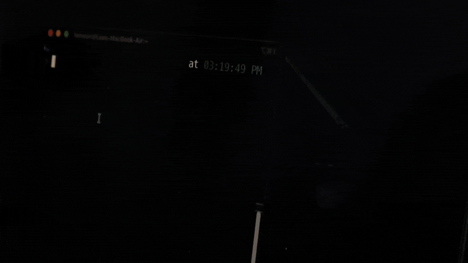

# Slower

<p align="center">
  
</p>

Slower is a tiny background reminder that delivers any custom message on a schedule.

## Requirements

- macOS (uses `osascript` for notifications and `say` for voice)
- `bash` (invoked via `/usr/bin/env bash`)

If `osascript` or `say` is not available, Slower will still run but will skip that capability.

## Install

```bash
brew tap leovoon/tap
brew install slower
```

## Usage

### Quick Start

```bash
slower start
slower status
```

### Examples

```bash
slower start -t 45
slower start -t 45 -m "Stand up and stretch" -s "Ping" -v "Samantha"
slower start --name work -t 45 --quiet 22:00-08:00 --log
slower run -t 45
slower stop
slower stop --all
slower uninstall
slower status
slower status --all
slower --help
slower voices
slower sessions
```

### Options

- `-t`, `--time` - interval in minutes (default: 60)
- `-n`, `--name` - session name (default: `default`)
- `--quiet` - quiet hours in `HH:MM-HH:MM` (no notifications)
- `-m`, `--message` - notification and spoken message
- `--say-message` - spoken message only (overrides `--message` for voice)
- `-s`, `--sound` - notification sound name (use `none` for silent)
- `-v`, `--voice` - voice name for `say` (use `none` to disable speech)
- `--log [path]` - enable logging (default: `~/.slower/logs/<name>.log`)
- `-a`, `--all` - apply to all sessions with `stop` or `status`

## Behavior Notes

- Stores session PID files in `~/.slower/<name>.pid` and cleans up stale PID files when detected.
- Prevents accidental PID reuse by recording the process start time.
- Set `--sound none` for silent notifications and `--voice none` to disable speech.
- `slower status` shows the remaining time until the next notification when available.

## Sessions

Use `--name` to run multiple independent sessions. Each session has its own PID and state files under `~/.slower/` (for example `~/.slower/work.pid` and `~/.slower/work.state`).

Example:

```bash
slower start --name work -t 45
slower status --name work
```

## Quiet Hours

Use `--quiet HH:MM-HH:MM` to suppress notifications during a time window. Cross-midnight ranges like `22:00-08:00` are supported.

## Logging

Use `--log` to write timestamped events to `~/.slower/logs/<name>.log`, or `--log /path/to/file.log` to choose a custom location.

## Uninstall

If you ran the binary manually:

```bash
slower uninstall
```

To uninstall a specific session:

```bash
slower uninstall --name work
slower uninstall --name work --purge
```

To stop all sessions:

```bash
slower stop --all
```

If you copied or symlinked the binary into your PATH, remove that file. Examples:

```bash
rm -f ~/bin/slower
rm -f /usr/local/bin/slower
```

## Credits

This script is a remix of a walker reminder by Mario Zechner (@badlogicgames, [https://x.com/badlogicgames](https://x.com/badlogicgames)). Thanks for the original inspiration.
