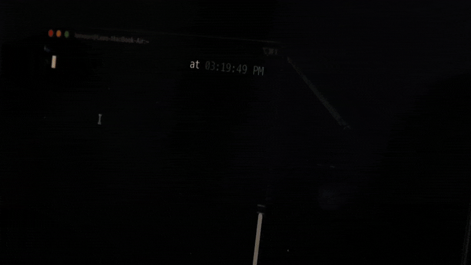

# Slower

<p align="center">
  
</p>

Slower is a macOS reminder CLI written in V. It can run in the foreground, start a detached background worker, or install a `launchd` agent for login-managed reminders.

## Requirements

- macOS
- [V](https://docs.vlang.io/)

Slower uses system commands for platform integration:

- `osascript` for notifications
- `say` for speech
- `launchctl` for `launchd` management

If `osascript` or `say` is unavailable, Slower skips that capability.

## Build

```bash
make build
```

If `v` is not on your `PATH`, pass it explicitly:

```bash
make V=/path/to/v build
```

Or directly:

```bash
v -o slower ./cmd/slower/main.v
```

## Test

```bash
make test
```

Or directly:

```bash
v test .
```

## Usage

### Quick Start

```bash
./slower start --interval 45 --message "Stand up and stretch"
./slower status
./slower stop
```

### Commands

```bash
./slower run
./slower start
./slower stop
./slower status
./slower list
./slower voices
./slower launchd install
./slower launchd uninstall
```

### Shared Flags

- `--session`, `-n` - session name (default: `default`)
- `--interval`, `-i` - interval in minutes (default: `60`)
- `--quiet`, `-q` - quiet hours in `HH:MM-HH:MM`
- `--message`, `-m` - notification message
- `--say-message` - spoken message only
- `--sound`, `-s` - notification sound name, or `none`
- `--voice`, `-v` - voice name for `say`, or `none`
- `--log` - enable logging to `~/.slower/logs/<session>.log`
- `--log /path/to/file.log` - compatibility form for a custom log path
- `--log --log-path /path/to/file.log` - explicit custom log path form

### Detached Sessions

```bash
./slower start --session work --interval 45 --quiet 22:00-08:00 --log
./slower status --session work
./slower stop --session work
```

Use `--all` with `stop` or `status` to act on every known session.

### Foreground Mode

```bash
./slower run --session focus --interval 25 --sound none --voice none
```

### launchd

Install a login-managed agent:

```bash
./slower launchd install --session work --interval 45 --message "Stretch"
```

Preview the generated plist without installing it:

```bash
./slower launchd install --dry-run --session work --interval 45
```

Remove the agent:

```bash
./slower launchd uninstall --session work
./slower launchd uninstall --session work --purge
```

`stop` unloads a running `launchd` job but keeps the plist on disk. `launchd uninstall` removes the plist.

## Compatibility Aliases

The V rewrite keeps a few old shell-era aliases so existing usage does not break immediately:

- `sessions` maps to `list`
- top-level `uninstall` maps to `launchd uninstall`
- `--name` maps to `--session`
- `--time` and `-t` map to `--interval`

## State Layout

Slower stores runtime state under `~/.slower/`:

- `sessions/<session>.json` - session state
- `locks/<session>.lock` - single-instance lock
- `logs/<session>.log` - session event log

LaunchAgents are written to:

- `~/Library/LaunchAgents/com.leovoon.slower[.<session>].plist`

## Development

Format:

```bash
make fmt
```

Release build:

```bash
make release
```

## Credits

This project is inspired by a walker reminder by Mario Zechner (@badlogicgames, [https://x.com/badlogicgames](https://x.com/badlogicgames)).
